<div align="center">

# 🚕🚲 Análisis de Movilidad Multimodal de Nueva York

### Arquitectura Medallion End-to-End en Azure Databricks

[](https://azure.microsoft.com/)
[](https://www.databricks.com/)
[](https://spark.apache.org/)
[](https://delta.io/)
[](https://www.databricks.com/product/unity-catalog)
[](https://github.com/features/actions)
[](https://powerbi.microsoft.com/)

**Taxi · Citi Bike · Clima · Geoespacial · PySpark · CI/CD · Power BI**

</div>

---

## 🎯 Descripción

Este proyecto implementa una solución completa de **Ingeniería de Datos** para analizar la movilidad multimodal de la ciudad de Nueva York, integrando viajes de **Taxi**, viajes de **Citi Bike**, información horaria de **clima** y la geografía oficial de **Taxi Zones**.

La solución fue desarrollada en un ambiente **Azure Databricks DEV** mediante una arquitectura **Medallion** sobre **Azure Data Lake Storage Gen2**, con procesamiento distribuido en **PySpark**, tablas **Delta Lake**, gobierno centralizado mediante **Unity Catalog**, autenticación a la capa Raw mediante **Managed Identity**, orquestación con **Databricks Jobs**, seguridad basada en grupos, publicación mediante **Delta Sharing**, consumo desde **Power BI** y promoción **DEV → PROD** mediante **GitHub Actions**.

### Periodo de análisis

**01 de enero de 2016 al 30 de junio de 2016**

---

## ✨ Características principales

- 🔄 **ETL automatizado**: Raw → Bronze → Silver → Golden.
- 🏗️ **Arquitectura Medallion** con containers físicos independientes.
- ⚡ **PySpark** para ingesta, limpieza, DQ, joins, enriquecimiento y agregaciones.
- 🗺️ **Procesamiento geoespacial** mediante Taxi Zones.
- 🌦️ **Integración climática** a nivel horario.
- 🔐 **Managed Identity** para acceso a ADLS Gen2.
- 🧭 **Unity Catalog** para catálogo, schemas, tablas, credenciales y External Locations.
- 👥 **RBAC** mediante grupos `DAs`, `DEs` y `PAs`.
- 🔗 **Delta Sharing** para exponer únicamente productos Golden.
- 📊 **Power BI** conectado a `mobility_share`.
- 🚀 **CI/CD DEV → PROD** con GitHub Actions.
- 🔁 **Reversión Medallion** mediante notebook dedicado.

---

# 🏛️ Arquitectura

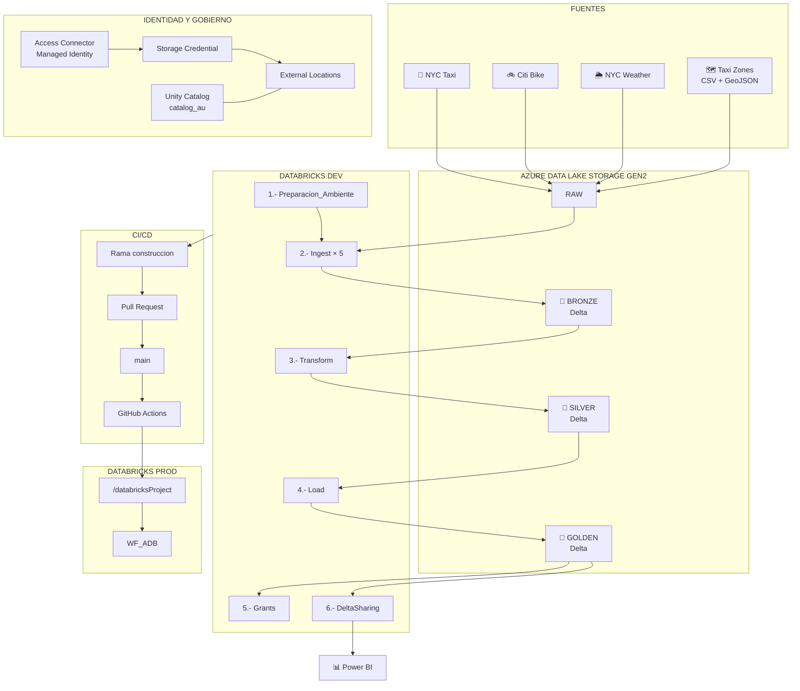
```mermaid
flowchart TB

    subgraph FUENTES["FUENTES"]
        TAXI["🚕 NYC Taxi"]
        BIKE["🚲 Citi Bike"]
        WEATHER["🌦️ NYC Weather"]
        ZONES["🗺️ Taxi Zones<br/>CSV + GeoJSON"]
    end

    subgraph STORAGE["AZURE DATA LAKE STORAGE GEN2"]
        RAW["RAW"]
        BRONZE["🥉 BRONZE<br/>Delta"]
        SILVER["🥈 SILVER<br/>Delta"]
        GOLDEN["🥇 GOLDEN<br/>Delta"]
    end

    subgraph GOVERNANCE["IDENTIDAD Y GOBIERNO"]
        AC["Access Connector<br/>Managed Identity"]
        CRED["Storage Credential"]
        EXT["External Locations"]
        UC["Unity Catalog<br/>catalog_au"]
    end

    subgraph DEV["DATABRICKS DEV"]
        PREP["1.- Preparacion_Ambiente"]
        ING["2.- Ingest × 5"]
        TRANS["3.- Transform"]
        LOAD["4.- Load"]
        GRANTS["5.- Grants"]
        SHARE["6.- DeltaSharing"]
    end

    subgraph CICD["CI/CD"]
        BRANCH["Rama construccion"]
        PR["Pull Request"]
        MAIN["main"]
        ACTIONS["GitHub Actions"]
    end

    subgraph PROD["DATABRICKS PROD"]
        NB["/databricksProject"]
        WF["WF_ADB"]
    end

    PBI["📊 Power BI"]

    TAXI --> RAW
    BIKE --> RAW
    WEATHER --> RAW
    ZONES --> RAW

    AC --> CRED --> EXT
    UC --- EXT

    RAW --> ING --> BRONZE
    BRONZE --> TRANS --> SILVER
    SILVER --> LOAD --> GOLDEN

    PREP --> ING
    GOLDEN --> GRANTS
    GOLDEN --> SHARE --> PBI

    DEV --> BRANCH --> PR --> MAIN --> ACTIONS --> NB --> WF
```

> **Pendiente para la versión final:** agregar también el diagrama PNG definitivo de arquitectura utilizado en la presentación.

---

# ☁️ Infraestructura Azure

La solución fue aprovisionada dentro del Resource Group:

```text
cc-databricks
```

Recursos principales del proyecto:

```text
ac-proyecto
adbproyectodev
adbproyectoprod
adlsproyecto
```

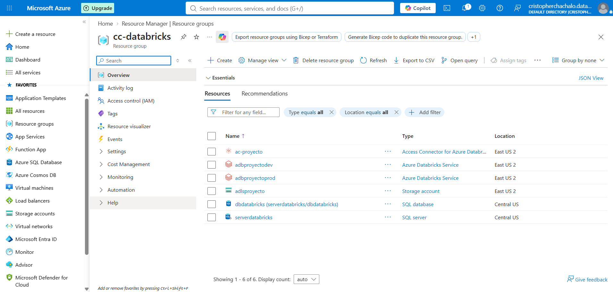

## 🗄️ Azure Data Lake Storage Gen2

La cuenta de almacenamiento `adlsproyecto` contiene containers separados para las diferentes capas y el metastore:

```text
bronze
silver
golden
raw
metastore
$logs
```

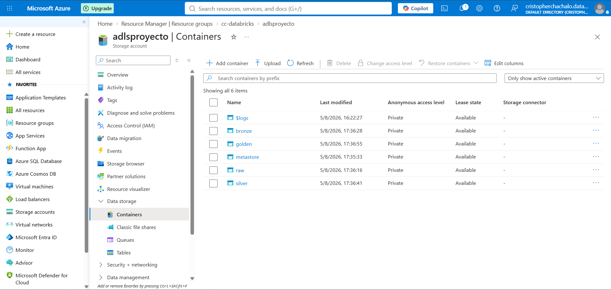

---

# 🔐 Managed Identity y acceso a ADLS

La conexión entre Azure Databricks y ADLS Gen2 se implementó mediante un **Access Connector for Azure Databricks**.

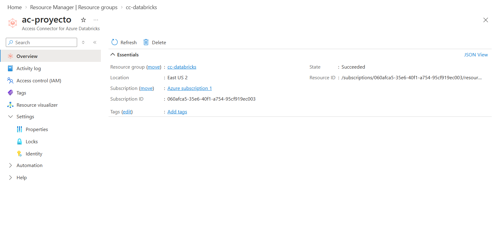

La identidad administrada `ac-proyecto` posee el rol:

```text
Storage Blob Data Contributor
```

sobre el Storage Account.

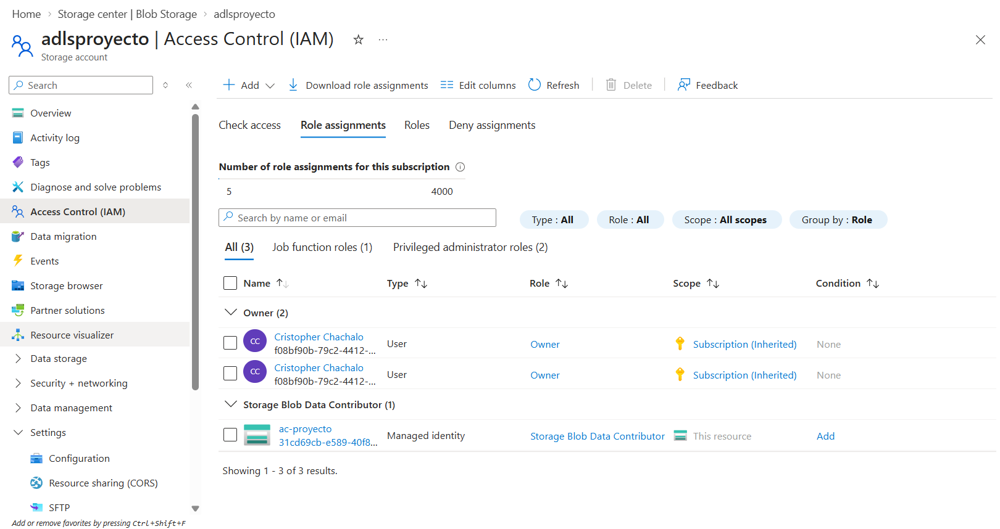

El patrón utilizado es:

```text
Databricks Access Connector
        ↓
Managed Identity
        ↓
Storage Credential
        ↓
External Location
        ↓
ADLS Gen2
```

Esto evita almacenar claves de Storage directamente en los notebooks.

---

# 🗂️ Capa Raw

La capa Raw se mantiene en ADLS Gen2 y conserva los archivos fuente sin aplicar transformaciones de negocio.

Estructura:

```text
raw/
├── citibike/
├── taxi/
├── taxi_zones/
└── weather/
```

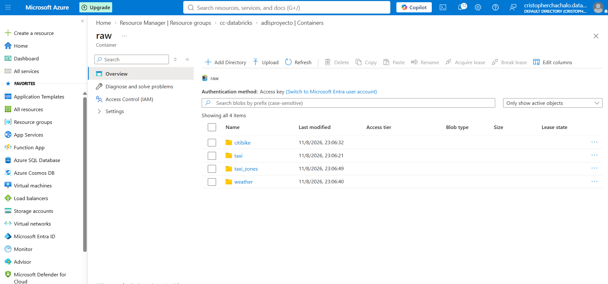

## 🚲 Citi Bike

Se utilizaron nueve archivos CSV correspondientes al periodo enero-junio de 2016.

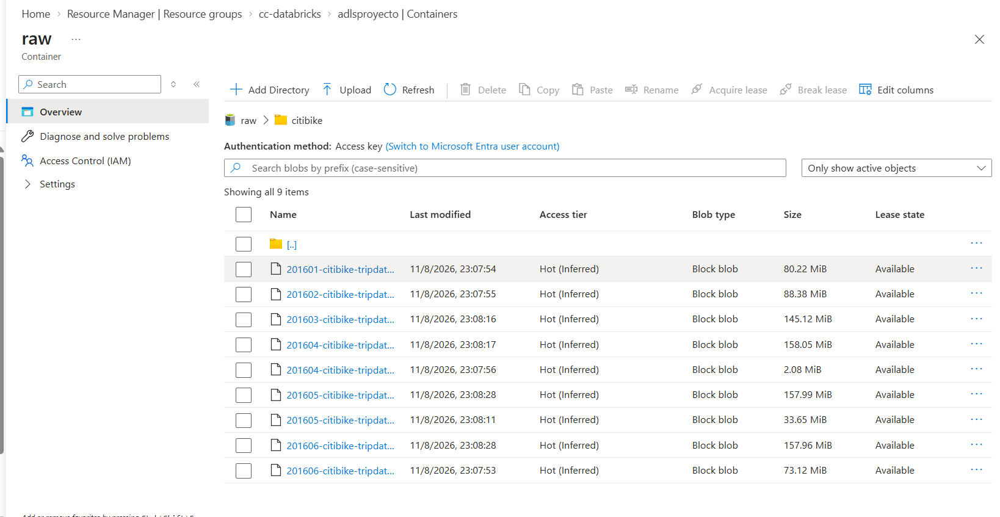

```text
Total viajes auditados: 5,676,020
```

## 🚕 Taxi

Archivo principal:

```text
NYC.csv
```

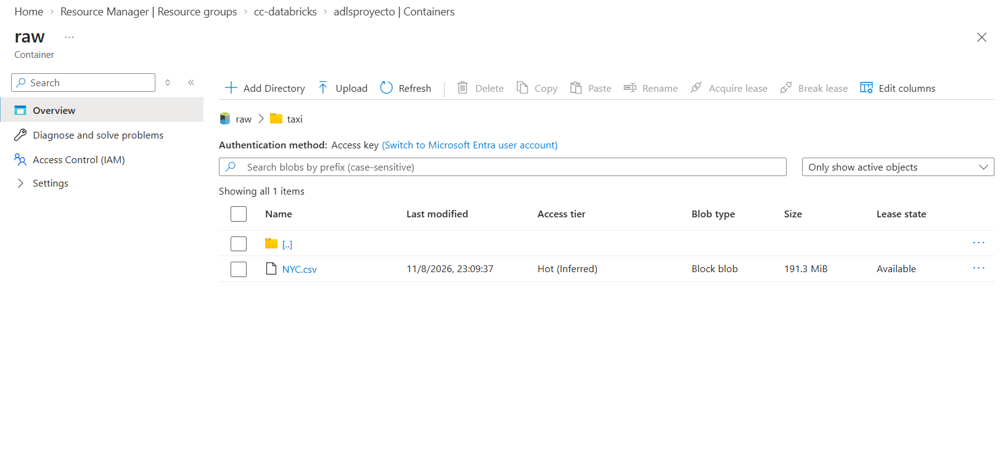

```text
Total viajes auditados: 1,458,644
```

## 🗺️ Taxi Zones

Se utilizaron dos representaciones:

```text
NYC Taxi Zones.geojson
taxi_zones.csv
```

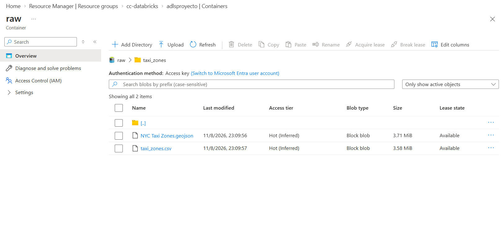

## 🌦️ Weather

Fuente climática:

```text
NYC_Weather_2016_2022.csv
```

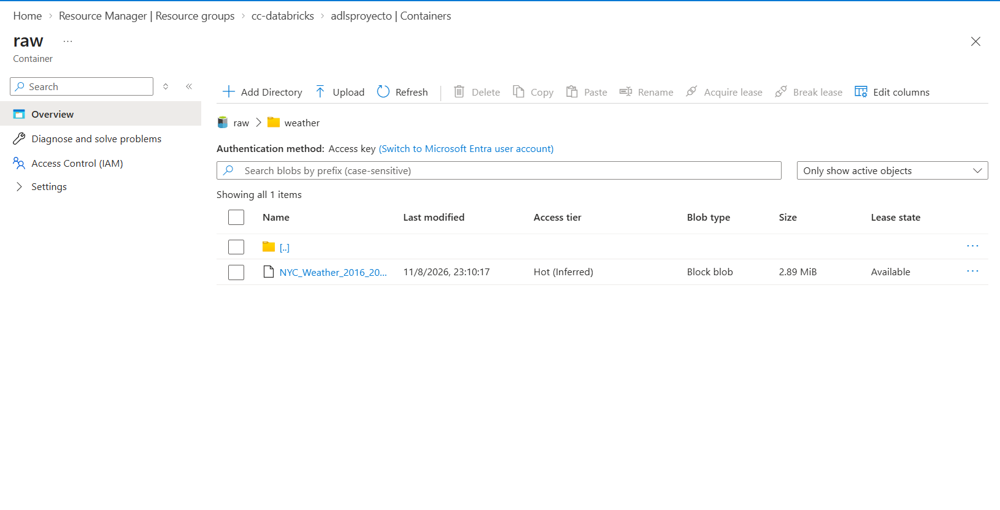

Para el periodo objetivo se utilizaron **4,368 registros horarios**.

---

# 🧭 Unity Catalog

Catálogo principal:

```text
catalog_au
```

Schemas:

```text
catalog_au.bronze
catalog_au.silver
catalog_au.golden
```

## External Locations

Las capas físicas están gobernadas mediante Unity Catalog y el Storage Credential `credential`.

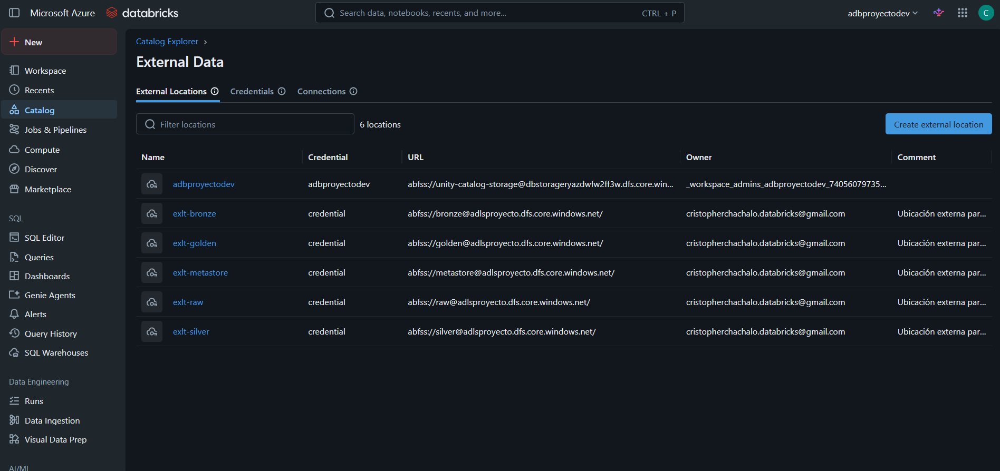

External Locations principales:

```text
exlt-raw
exlt-bronze
exlt-silver
exlt-golden
exlt-metastore
```

---

# 📦 Arquitectura Medallion

<table>
<tr>
<td width="33%" valign="top">

### 🥉 Bronze

**Propósito:** ingesta tipada y trazable.

**Tablas:**

- `taxi_trips`
- `citibike_trips`
- `weather_hourly`
- `taxi_zones_geojson`
- `taxi_zones_csv`

**Características:**

- ✅ Raw → Delta
- ✅ Tipos básicos
- ✅ Metadatos de ingesta
- ✅ Sin lógica analítica final

</td>
<td width="33%" valign="top">

### 🥈 Silver

**Propósito:** calidad, normalización e integración.

**Tablas:**

- `taxi_trips`
- `citibike_trips`
- `weather_hourly`
- `taxi_zone_features`
- `taxi_zones`
- `taxi_trips_enriched`
- `citibike_trips_enriched`
- `mobility_events`

**Características:**

- ✅ DQ
- ✅ Spatial Join
- ✅ Weather Join
- ✅ Modelo multimodal

</td>
<td width="33%" valign="top">

### 🥇 Golden

**Propósito:** productos analytics-ready.

**Data marts:**

- `mobility_hourly`
- `mobility_weather`
- `mobility_zone`
- `transport_comparison`

**Características:**

- ✅ Pre-agregados
- ✅ Reconciliados
- ✅ Orientados a BI
- ✅ Compartidos con Power BI

</td>
</tr>
</table>

---

# 🥈 Silver: calidad e integración

La capa Silver consolida las fuentes y aplica:

- casteo y normalización;
- tratamiento de fechas y timestamps;
- validación de duración;
- validación de coordenadas;
- validación espacial;
- enriquecimiento por Taxi Zones;
- integración con Weather;
- variables temporales;
- indicadores de precipitación y lluvia;
- clasificación de clima;
- homologación de Taxi y Citi Bike;
- indicador final `dq_valid_event`.

## Resultado `mobility_events`

| Métrica | Valor |
|---|---:|
| Eventos totales | 7,134,664 |
| Eventos válidos | 7,130,555 |
| Eventos inválidos | 4,109 |
| Taxi válidos | 1,454,641 |
| Bike válidos | 5,675,914 |
| Missing Weather | 0 |

> 📸 **Pendiente:** agregar capturas de `silver.mobility_events`, validaciones DQ y reconciliación Silver.

---

# 🥇 Golden: capa analítica

| Tabla | Filas | Σ Viajes |
|---|---:|---:|
| `mobility_hourly` | 490,915 | 7,130,555 |
| `mobility_weather` | 8,626 | 7,130,555 |
| `mobility_zone` | 321 | 7,130,555 |
| `transport_comparison` | 316,412 |
| Páginas Power BI | 3 | 7,130,555 |

`transport_comparison` reconcilia:

```text
Taxi = 1,454,641
Bike = 5,675,914
Total = 7,130,555
invalid_trip_balance = 0
invalid_share_balance = 0
```

> 📸 **Pendiente:** agregar capturas de tablas Golden y reconciliación final.

---

# 🔄 Orquestación ETL en DEV

El Job desarrollado en DEV se denomina:

```text
ETL_Analisis_Movilidad_Multimodal_NYC
```

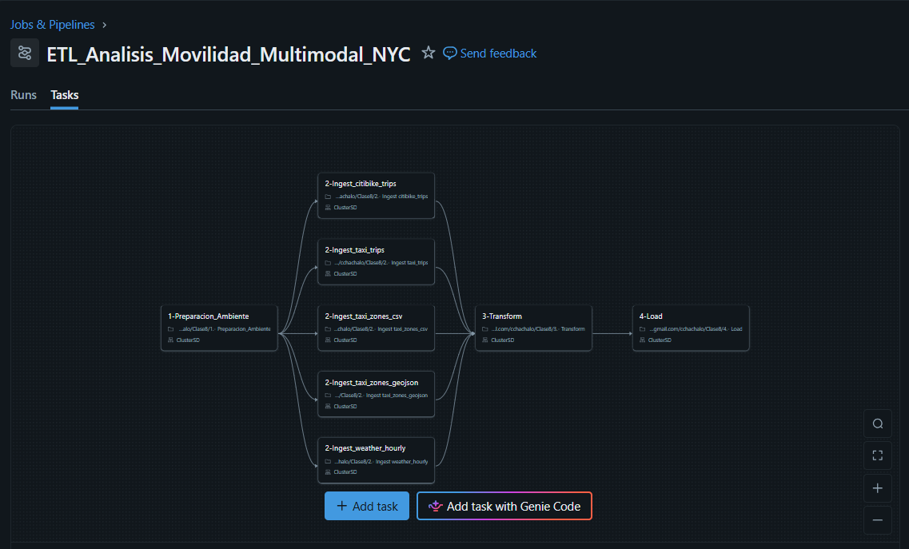

Las cinco tareas de ingesta se ejecutan en paralelo después de `1-Preparacion_Ambiente`.

```text
1-Preparacion_Ambiente
        │
        ├── 2-Ingest_citibike_trips
        ├── 2-Ingest_taxi_trips
        ├── 2-Ingest_taxi_zones_csv
        ├── 2-Ingest_taxi_zones_geojson
        └── 2-Ingest_weather_hourly
                        │
                        ▼
                   3-Transform
                        │
                        ▼
                     4-Load
```

Esta dependencia evita ejecutar Silver con una fuente incompleta.

> 📸 **Pendiente:** evidencia final del Job DEV ejecutado completamente en estado SUCCESS.

---

# 👥 Seguridad y RBAC

Se crearon usuarios de prueba y grupos de cuenta para demostrar administración de permisos.

## Usuarios

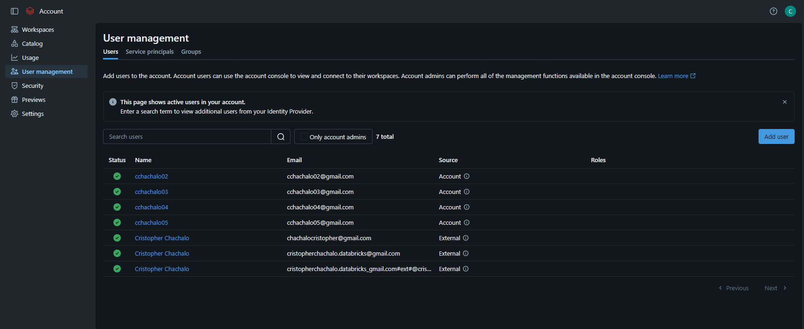

## Grupos

```text
DAs → Data Analysts
DEs → Data Engineers
PAs → Platform Administrators
```

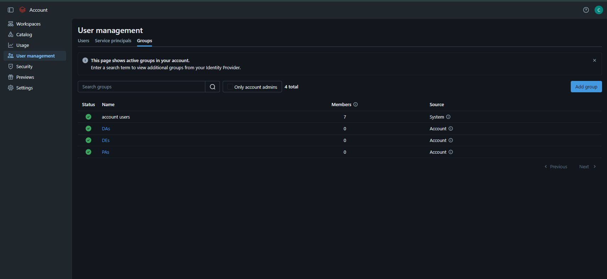

## Permisos sobre workspace DEV

- `DAs`: User
- `DEs`: User
- `PAs`: Admin

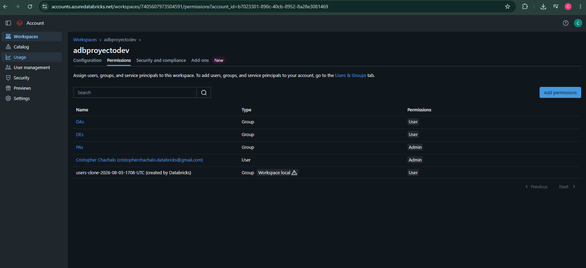

## Membresía por rol

### DAs

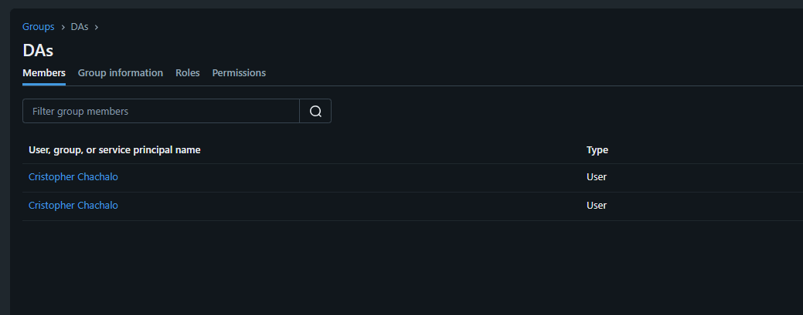

### DEs

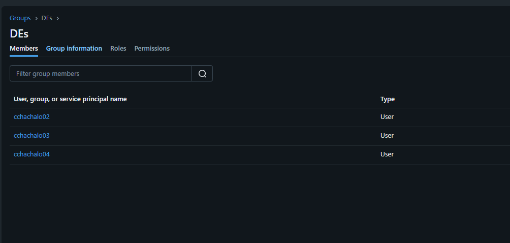

### PAs

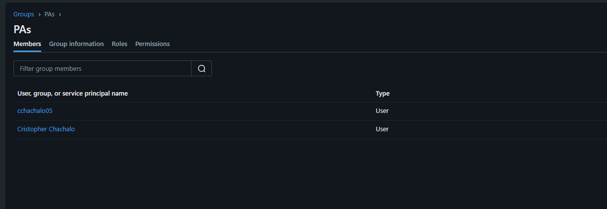

## Matriz de acceso a datos

| Recurso | DAs | DEs | PAs |
|---|---:|---:|---:|
| Raw | ❌ | READ | ADMIN |
| Bronze | ❌ | SELECT / MODIFY | ADMIN |
| Silver | ❌ | SELECT / MODIFY | ADMIN |
| Golden | SELECT | SELECT / MODIFY | ADMIN |

> 📸 **Pendiente:** agregar resultados `SHOW GRANTS` de catálogo, schemas y External Locations.

---

# 🔗 Delta Sharing y Power BI

Share creado:

```text
mobility_share
```

Recipient:

```text
powerbi_recipient
```

Tablas Golden compartidas:

```text
mobility_hourly
mobility_weather
mobility_zone
transport_comparison
```

La conexión desde Power BI fue validada exitosamente. El navegador de Power BI muestra las cuatro tablas Golden del Share.

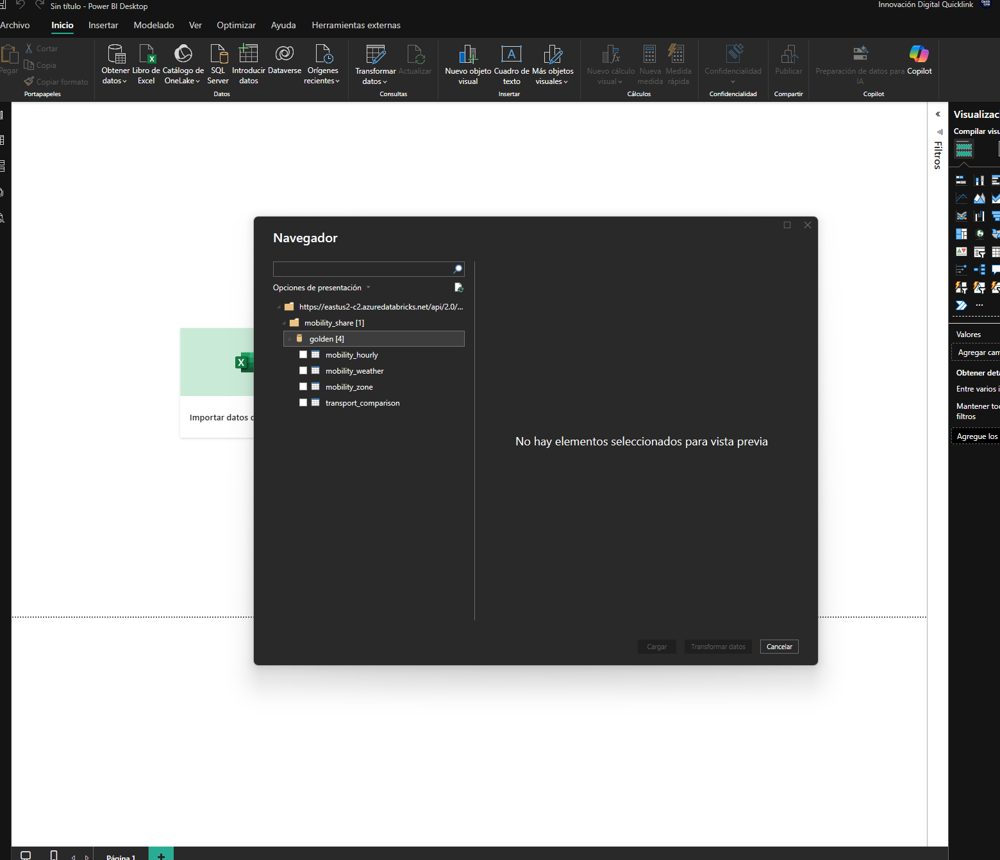

> ⚠️ No almacenar en el repositorio el bearer token, activation link ni archivo de credenciales de Delta Sharing.

> 📸 **Pendiente:** agregar capturas del Share, Recipient y grants del Share.

---

# 🌿 Git y estructura de desarrollo

Azure Databricks fue conectado con el repositorio Git utilizado para el proyecto.

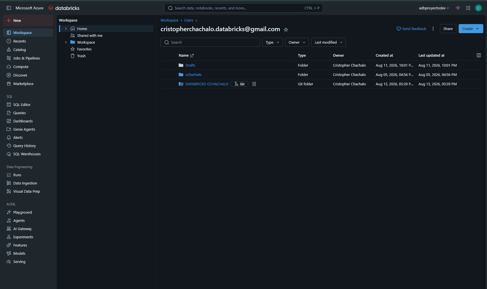

Se trabajó con dos ramas principales:

```text
main
construccion
```

La rama `construccion` fue utilizada para incorporar los artefactos antes de promoverlos mediante Pull Request.

---

# 📁 Estructura del repositorio

La rama de construcción contiene la estructura requerida para la entrega.

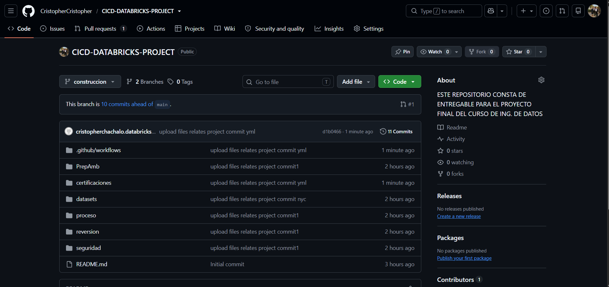

```text
CICD-DATABRICKS-PROJECT/
│
├── .github/
│   └── workflows/
│       └── deploy-notebook.yml
│
├── PrepAmb/
├── certificaciones/
├── datasets/
├── proceso/
├── reversion/
├── seguridad/
│
├── dashboard/
│   ├── Analisis_Movilidad_Multimodal_NYC.pbix
│   ├── 01_resumen_ejecutivo.png
│   ├── 02_clima_comportamiento_temporal.png
│   └── 03_analisis_geografico_zonas.png
│
├── evidencias/         # capturas finales del proyecto
└── README.md
```

---

# 🚀 CI/CD DEV → PROD

El flujo de promoción implementado es:

```text
Databricks DEV
      ↓
rama construccion
      ↓
Pull Request
      ↓
main
      ↓
GitHub Actions
      ↓
Databricks PROD
      ↓
WF_ADB
```

## Pull Request

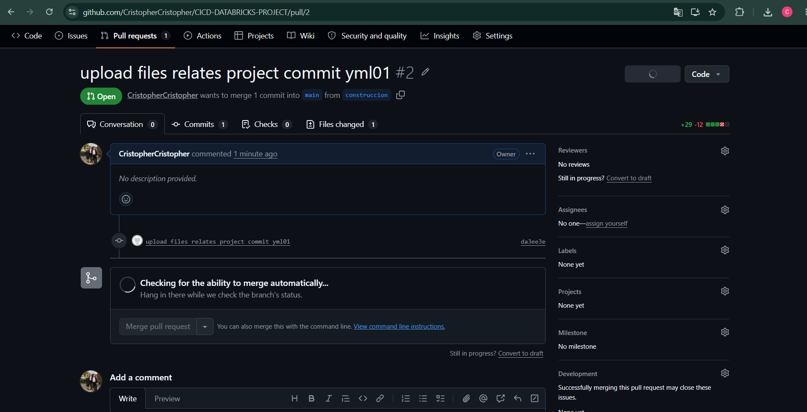

## GitHub Actions

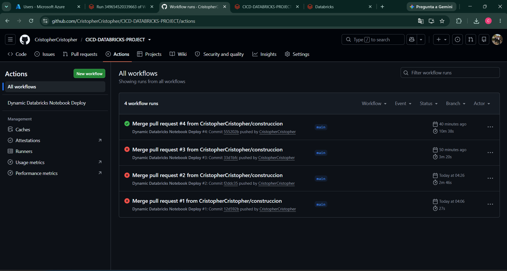

Durante la implementación se realizaron varias iteraciones hasta obtener un despliegue exitoso. Los primeros runs permitieron corregir aspectos de exportación/importación y preservación del lenguaje original de notebooks SQL y Python.

El último run visible en la evidencia finaliza correctamente:

```text
Dynamic Databricks Notebook Deploy ✅
```

## Proceso automatizado

GitHub Actions:

1. obtiene los notebooks desde DEV;
2. identifica su lenguaje original;
3. exporta los notebooks como `SOURCE`;
4. importa los notebooks en PROD conservando SQL/Python;
5. localiza el cluster productivo;
6. crea el workflow `WF_ADB`;
7. ejecuta el workflow;
8. monitorea la ejecución.

---

# 🖥️ Compute de Producción

Cluster:

```text
cluster_SD
```

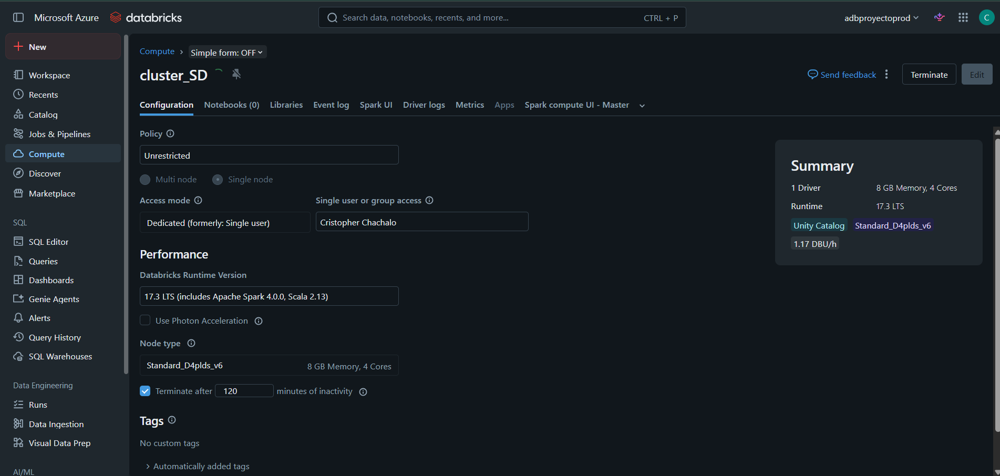

Configuración visible:

```text
Databricks Runtime : 17.3 LTS
Apache Spark        : 4.0.0
Scala               : 2.13
Access mode         : Dedicated
Node type           : Standard_D4plds_v6
Unity Catalog       : habilitado
```

> 📸 **Pendiente:** captura del DAG `WF_ADB` y ejecución completa SUCCESS en PROD.

---

# 🔁 Reversión

Se creó:

```text
reversion/
└── 1.- Drop-Medallion
```

El notebook elimina tablas lógicas y rutas físicas de:

```text
Bronze
Silver
Golden
```

Raw permanece intacto.

> 📸 **Pendiente:** agregar evidencia de `1.- Drop-Medallion`.

---

# 📊 Dashboard Power BI

La capa de visualización fue implementada en **Power BI Desktop**, consumiendo exclusivamente las cuatro tablas de la capa Golden compartidas mediante **Delta Sharing**.

Archivo principal:

```text
dashboard/
└── Analisis_Movilidad_Multimodal_NYC.pbix
```

El reporte utiliza un modelo analítico de tipo **constelación de hechos**, donde las tablas Golden comparten dimensiones conformadas. Esto evita relacionar directamente tablas agregadas con granularidades distintas y mantiene un modelo más limpio y controlado.

## 🧩 Modelo analítico en Power BI

Se crearon las siguientes dimensiones:

```text
DimFecha
DimHora
DimZona
DimTransporte
DimClima
_Medidas
```

Relaciones principales:

| Dimensión | `mobility_hourly` | `mobility_weather` | `mobility_zone` | `transport_comparison` |
|---|:---:|:---:|:---:|:---:|
| `DimFecha` | ✅ | ✅ | — | ✅ |
| `DimHora` | ✅ | ✅ | — | ✅ |
| `DimZona` | ✅ | — | ✅ | ✅ |
| `DimTransporte` | ✅ | ✅ | ✅ | — |
| `DimClima` | — | ✅ | — | ✅ |

Las relaciones fueron configuradas con cardinalidad **1:\*** y dirección de filtro única desde las dimensiones hacia las tablas Golden.

## 🧮 Medidas DAX

Las medidas fueron centralizadas en la tabla `_Medidas`.

Entre las principales se encuentran:

- `Total Viajes`
- `Viajes Seleccionados`
- `Viajes Taxi`
- `Viajes Citi Bike`
- `% Viajes Taxi`
- `% Viajes Citi Bike`
- `Viajes Promedio por Día`
- `Duración Promedio`
- `Días Analizados`
- `Zonas Activas`
- `Hora Pico`
- `% Viajes Fin de Semana`
- `Viajes con Lluvia`
- `% Viajes con Lluvia`
- `Temperatura Promedio Viajes`
- `Precipitación Total`
- `% Impacto Lluvia`
- `Condición Climática Principal`
- `Zona Líder`
- `Borough Líder`
- `% Concentración Top 5 Zonas`
- `Zonas Dominio Taxi`
- `Zonas Dominio Bike`

## 🎨 Diseño del dashboard

El lienzo fue configurado en:

```text
2020 × 1080 px
```

Para acelerar el desarrollo y mejorar la presentación visual se utilizó:

- **HTML Content + SVG** para tarjetas, gráficos, rankings, heatmaps e insights.
- **Segmentadores nativos de Power BI** para los filtros interactivos.
- Diseño en modo oscuro.
- Colores diferenciados para Taxi, Citi Bike, clima y métricas de alerta.
- Títulos, valores e insights dinámicos según el contexto de filtros.

Los filtros utilizados son:

```text
Periodo
Transporte
Borough
Clima
Franja Horaria / Zona según la página
```

---

## 📊 Página 1 — Resumen Ejecutivo

La primera página responde:

> **¿Qué está ocurriendo con la movilidad multimodal?**

Incluye:

- total de viajes;
- promedio diario;
- duración promedio;
- zonas activas;
- hora pico;
- participación de viajes de fin de semana;
- evolución mensual;
- Top 5 zonas;
- patrón semanal;
- comparación mensual Taxi vs Citi Bike;
- zona, borough, mes y condición climática principales.

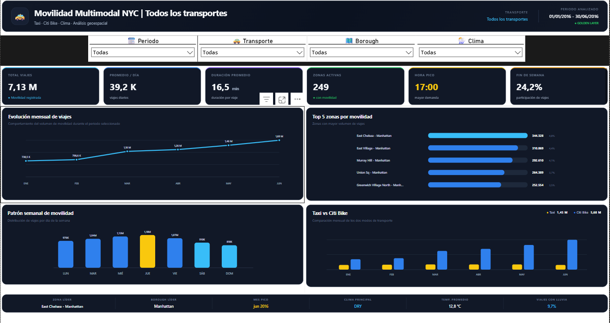

### Indicadores visibles sin filtros

| Indicador | Resultado |
|---|---:|
| Total viajes | 7.13 M |
| Promedio diario | 39.2 K |
| Duración promedio | 16.5 min |
| Zonas activas | 249 |
| Hora pico | 17:00 |
| Viajes fin de semana | 24.2 % |
| Zona líder | East Chelsea - Manhattan |
| Borough líder | Manhattan |
| Mes pico | junio 2016 |
| Clima principal | DRY |
| Temperatura promedio | 12.8 °C |
| Viajes con lluvia | 9.7 % |

---

## 🌦️ Página 2 — Clima y Comportamiento Temporal

La segunda página responde:

> **¿Cuándo ocurre la movilidad y cómo se relaciona con el clima?**

Incluye:

- temperatura promedio;
- precipitación total;
- participación de viajes con lluvia;
- días con lluvia;
- horas con lluvia;
- impacto de la lluvia sobre viajes promedio por hora;
- heatmap Día × Hora;
- movilidad por condición climática;
- movilidad por rangos de temperatura.

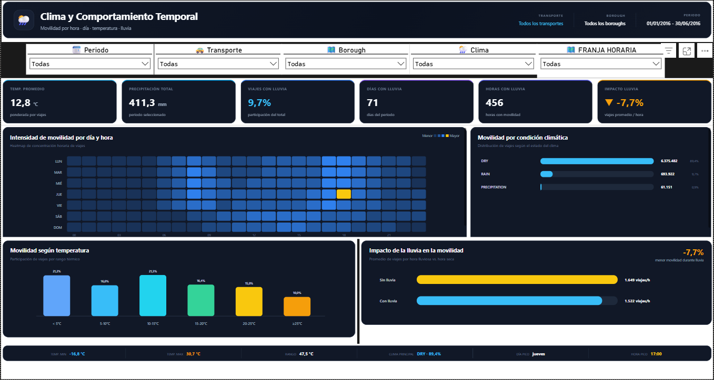

### Indicadores visibles sin filtros

| Indicador | Resultado |
|---|---:|
| Temperatura promedio | 12.8 °C |
| Precipitación total | 411.3 mm |
| Viajes con lluvia | 9.7 % |
| Días con lluvia | 71 |
| Horas con lluvia | 456 |
| Impacto de lluvia | -7.7 % |
| Temperatura mínima | -16.8 °C |
| Temperatura máxima | 30.7 °C |
| Rango térmico | 47.5 °C |
| Clima principal | DRY — 89.4 % |
| Día pico | jueves |
| Hora pico | 17:00 |

La comparación normalizada por hora muestra que, para el periodo completo, la movilidad promedio durante horas con lluvia es inferior a la registrada durante horas secas.

---

## 🗺️ Página 3 — Análisis Geográfico y Zonas

La tercera página responde:

> **¿Dónde se concentra la movilidad y qué modo de transporte domina por zona?**

Incluye:

- zonas activas;
- boroughs activos;
- concentración territorial del Top 5;
- número de zonas con dominio Taxi;
- número de zonas con dominio Citi Bike;
- ranking Top 10 de zonas;
- distribución por borough;
- mix modal Taxi/Citi Bike por zona;
- perfil dinámico de la zona analizada.

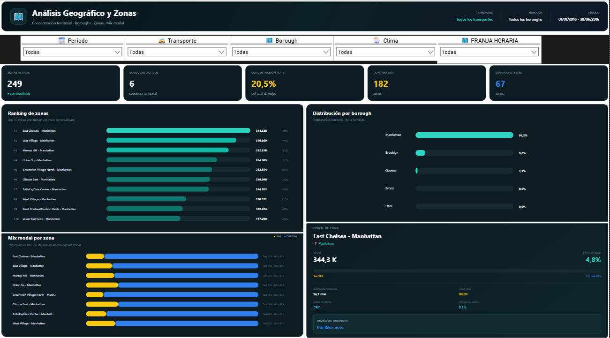

### Indicadores visibles sin filtros

| Indicador | Resultado |
|---|---:|
| Zonas activas | 249 |
| Boroughs activos | 6 |
| Concentración Top 5 | 20.5 % |
| Zonas con dominio Taxi | 182 |
| Zonas con dominio Citi Bike | 67 |
| Borough dominante | Manhattan — 89.2 % |
| Zona mostrada en perfil | East Chelsea - Manhattan |
| Viajes de la zona | 344.3 K |
| Participación de la zona | 4.8 % |
| Duración promedio de la zona | 14.7 min |
| Hora pico de la zona | 08:00 |
| Clima principal de la zona | DRY |
| Viajes con lluvia de la zona | 9.3 % |
| Transporte dominante | Citi Bike |

El panel de perfil permite profundizar en una zona específica manteniendo el mismo contexto de filtros del reporte.

---

## 🧭 Narrativa analítica

Las tres páginas fueron diseñadas como una secuencia de análisis:

```text
PÁGINA 1 — RESUMEN EJECUTIVO
¿Qué está ocurriendo?
          ↓
PÁGINA 2 — CLIMA Y COMPORTAMIENTO TEMPORAL
¿Cuándo ocurre y cómo influye el clima?
          ↓
PÁGINA 3 — ANÁLISIS GEOGRÁFICO Y ZONAS
¿Dónde ocurre y qué modalidad domina?
```

Esta estructura evita repetir visualizaciones y permite avanzar desde una visión ejecutiva hacia análisis temporales, climáticos y geográficos.

---

# 📈 Resultados principales

| Indicador | Resultado |
|---|---:|
| Fuentes integradas | 4 |
| Viajes Taxi Raw | 1,458,644 |
| Viajes Citi Bike Raw | 5,676,020 |
| Eventos multimodales | 7,134,664 |
| Eventos válidos | 7,130,555 |
| Taxi válidos | 1,454,641 |
| Bike válidos | 5,675,914 |
| Zonas activas Golden | 249 |
| Missing Weather | 0 |
| `mobility_hourly` | 490,915 |
| `mobility_weather` | 8,626 |
| `mobility_zone` | 321 |
| `transport_comparison` | 316,412 |
| Páginas Power BI | 3 |

---

# 🛠️ Tecnologías

<div align="center">

| Tecnología | Propósito |
|:---:|---|
| **Azure Databricks** | Motor principal de ingeniería y orquestación |
| **PySpark** | Transformación distribuida |
| **Delta Lake** | Persistencia Bronze/Silver/Golden |
| **ADLS Gen2** | Data Lake |
| **Unity Catalog** | Gobierno y seguridad |
| **Managed Identity** | Autenticación a Storage |
| **GitHub Actions** | CI/CD |
| **Delta Sharing** | Compartición de Golden |
| **Power BI** | Visualización |

</div>

---

# 🔒 Seguridad del repositorio

No deben publicarse:

```text
Personal Access Tokens
Bearer Tokens
Activation Links
Archivo de credenciales Delta Sharing
Contraseñas
Client Secrets
Connection Strings con secretos
```

> ⚠️ Algunas capturas actuales contienen correos o identificadores de Azure. Antes de publicar la versión definitiva del repositorio se recomienda anonimizar la información que no sea necesaria como evidencia académica.

---

# 📌 Estado actual

| Componente | Estado |
|---|---|
| Infraestructura Azure | ✅ |
| ADLS / Raw | ✅ |
| Managed Identity | ✅ |
| External Locations | ✅ |
| Bronze | ✅ |
| Silver | ✅ |
| Golden | ✅ |
| Job DEV creado | ✅ |
| GRANTS | ✅ |
| Delta Sharing | ✅ |
| Power BI conectado | ✅ |
| Git / ramas | ✅ |
| CI/CD GitHub Actions | ✅ |
| Reversión | ✅ creada |
| Workflow PROD | 🟡 ejecución final por validar |
| Dashboard Power BI | ✅ |
| Evidencias restantes | ⏳ |

---

# 📸 Evidencias pendientes para cerrar el README

- [ ] catálogo `catalog_au` y schemas;
- [ ] tablas Bronze;
- [ ] tablas Silver;
- [ ] validación `mobility_events`;
- [ ] tablas Golden;
- [ ] reconciliación Golden;
- [ ] `SHOW GRANTS`;
- [ ] Delta Share / Recipient;
- [ ] Job DEV SUCCESS;
- [ ] notebooks desplegados en PROD;
- [ ] DAG `WF_ADB`;
- [ ] ejecución PROD SUCCESS;
- [ ] reversión;
- [ ] arquitectura PNG definitiva.

---

# 👤 Autor

<div align="center">

### Cristopher Chachalo


[](https://www.linkedin.com/in/cristopher-manuel-chachalo-tulcan-490844201/)
[](https://github.com/CristopherCristopher)
[](mailto:chachalocristopher@gmail.com)

**Data Engineering** | **Azure Databricks** | **PySpark** | **Delta Lake** | **CI/CD**

</div>

---

<div align="center">

**Proyecto:** Análisis de Movilidad Multimodal de Nueva York  
**Tecnología:** Azure Databricks + PySpark + Delta Lake + Unity Catalog + GitHub Actions + Power BI  
**Estado:** Dashboard Power BI completado; proyecto en fase de cierre y validación final de evidencias/PROD

</div>
